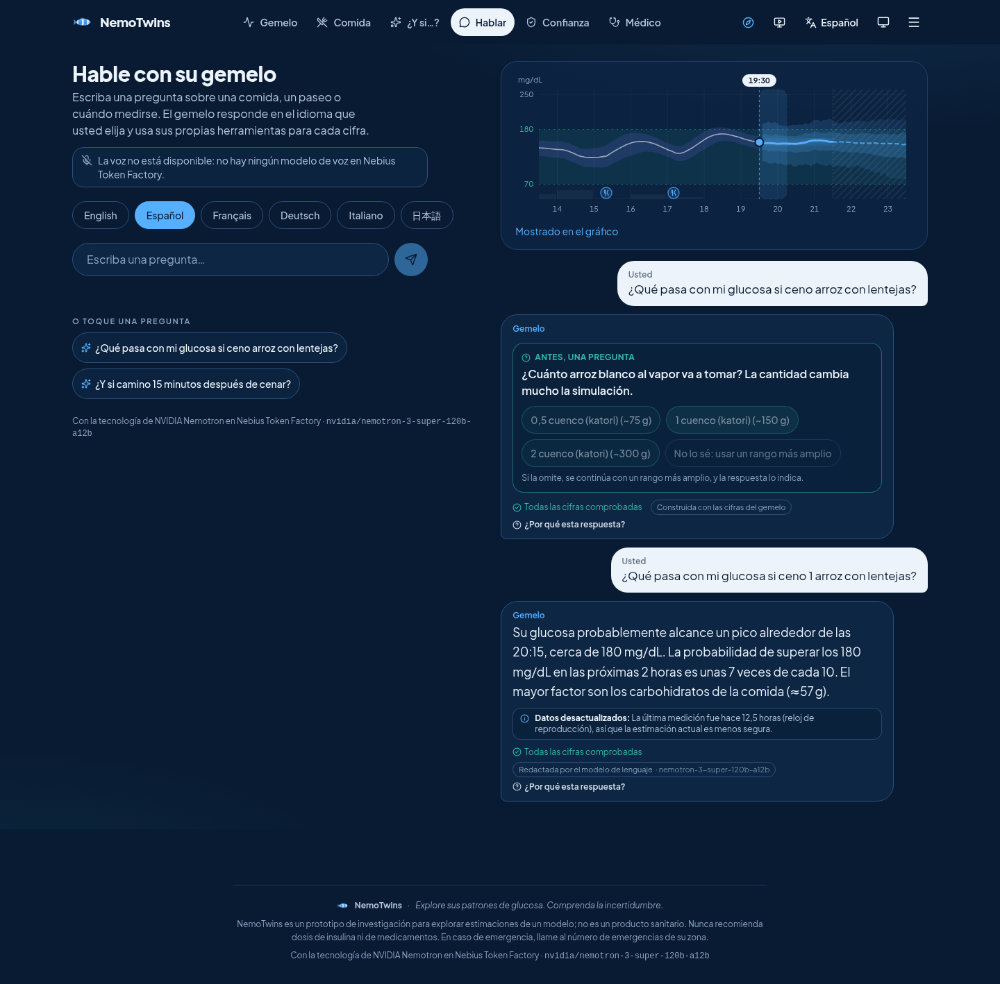

# NemoTwins

**Explore your glucose patterns. Understand the uncertainty.**

NemoTwins is a multilingual glucose digital twin with an agentic interface: you ask about a meal or a walk
in English, Spanish, French, German, Italian or Japanese; an assistant running on **NVIDIA Nemotron through
Nebius Token Factory** clarifies what is missing, calls the twin's own tools, and explains the engine's
estimates together with their uncertainty and limitations. It is a **research prototype for understanding
model estimates — not a medical device**, and it never recommends insulin or medicine doses.

Entry for the [Nebius × NVIDIA Global AI Hackathon](https://nebiusglobalaihackathon.devpost.com/)
(track: Best Apps and Agents). Live demo: https://nemotwins.koushikdeb.com (demo login `TestUser` / `TestUser11`).



## What it does

| | |
|---|---|
| **Measured / estimated / forecast / exploratory / retrospectively evaluated** | Every number is labelled by what it is. The twin's current estimate has a calibrated 90 % band; the raw model spread is labelled "not calibrated"; forecasts carry their horizon; what-ifs are exploratory simulations. |
| **Uncertainty changes behaviour** | A vague portion → one short question (with a "not sure" path that widens the engine's input uncertainty and says so). A stale reading → disclosed. Scenarios within simulation variability → "cannot be ranked". Questions beyond the evidence → answered from the evaluation report, not a projection. |
| **Numbers come from the engine** | Nemotron chooses tools and writes the explanation; a deterministic verifier checks every digit against this turn's tool outputs; NVIDIA NeMo Guardrails checks input and output. A failed draft falls back to an approved template that is labelled as such. |
| **Same numbers in every language** | Dishes map to the same food ids in all six languages; units are converted in code; the language never changes engine inputs. |
| **Further reading, safely** | Education questions get links to official health sites in the user's language (Tavily search on a fixed topic chosen by Nemotron; the user's words never leave the app; results are shown, never fed to the model). |
| **Evidence you can inspect** | "Why this answer?": tools used, model id, checks, engine version, receipts built from `backend/reports/`. |

## NVIDIA / Nebius integrations

| Integration | Status |
|---|---|
| NVIDIA Nemotron 3 Super (planner) and Nemotron 3 Nano (router, guardrails) via **Nebius Token Factory** | implemented, verified live |
| Token Factory tool calling + JSON / JSON-schema output | implemented, verified |
| **NVIDIA NeMo Guardrails** (input + output self-check rails on Nemotron) | implemented, verified |
| Nebius AI Cloud auth (IAM token / service account; read-only identity check) | implemented, verified |
| Hosting | self-hosted at https://nemotwins.koushikdeb.com ([`docs/SELF_HOSTING.md`](Codes/docs/SELF_HOSTING.md)); optional Nebius AI Cloud deployment scripts in [`docs/NEBIUS_DEPLOYMENT.md`](Codes/docs/NEBIUS_DEPLOYMENT.md) |
| Vision: dish candidates from a photo | Gemma 3 27B on Token Factory (**non-NVIDIA**: no NVIDIA vision model is offered there) |
| Further reading: links from allowlisted health sites for education questions | Tavily web-search API (not a model; topic-only queries; never shown to the model) |
| Speech | **not available**: Token Factory has no speech model and no other provider is used |

Details and measured settings: [`docs/PROVIDER_CAPABILITIES.md`](Codes/docs/PROVIDER_CAPABILITIES.md) ·
architecture: [`docs/ARCHITECTURE.md`](Codes/docs/ARCHITECTURE.md).

## Run it locally

Requirements: Python 3.11+, Node 20, PostgreSQL 16.

```bash
cd Codes
cp .env.example .env            # set TOKENFACTORY_2009_API_KEY (empty = offline template mode)
make install                    # pip install -r backend/requirements.lock && pip install -e backend[dev]; npm ci
createdb nemotwins             # or point DATABASE_URL at any PostgreSQL 16
make dev-api                    # http://127.0.0.1:8000/api/health
make dev-web                    # http://localhost:5180  (login: TestUser / TestUser11)
```

Docker: `docker compose up --build` → http://localhost:8080. Single container as deployed on Nebius:
`docker build -f deploy/Dockerfile -t nemotwins .` (serves the SPA and `/api` on port 8000).

Tests: `make test` (backend pytest + frontend vitest), `make lint`, `make typecheck`.

Evaluation (from `Codes/backend`):

```bash
python -m nemotwins.eval.numerical_regression --compare baseline_2026-10-08   # engine outputs stable?
APP_MODE=live python -m nemotwins.eval.provider_smoke                        # capability manifest
APP_MODE=live python -m nemotwins.eval.agent_multilingual --mode live --split heldout
```

## Results

Multilingual Nemotron agent suite (40 semantic + 8 over-blocking cases × 6 languages, deterministic
scoring): see [`docs/EVALUATION.md`](Codes/docs/EVALUATION.md) for protocol, denominators and failures.

The tables below are the twin engine's **retrospective** evaluation (CGMacros, nested person-wise
cross-validation; not clinical validation), generated from `Codes/backend/reports/*.json` by
`Codes/scripts/build_readme.py`.

<!-- RESULTS:START -->
_Tables generated by `scripts/build_readme.py` from `backend/reports/*.json`. Do not edit by hand; run `make readme`._

### Sensor ladder (Experiment 1, headline)
CGMacros v1.0.0 (PhysioNet), 45 adults (14 T2D, 16 prediabetes, 15 healthy)

_Protocol:_ Calibrate on the first 5 days of CGM (a 5-day CGM calibration wear), then hide the CGM. The twin sees only k simulated finger-pricks per day (fasting 07:00, 11:00, 16:00, post-dinner 22:00; glucometer error 5% sd) plus logged meals and activity. Forecasts every 30 min and at every meal; scored against the hidden CGM. Nested person-wise 5-fold cross-validation (every learned dependency of a fold's model, including the population priors behind its training rows, excludes that fold's people); 95% CIs bootstrap over people.

| Glucose data after calibration | RMSE 30 min | RMSE 60 min | RMSE 90 min | RMSE 120 min | RMSE 60 min (95% CI) | 90% band coverage (60 min) | 90% band width (60 min, mg/dL) | AUROC P(>180 in 2 h) (95% CI) | Clarke A+B, virtual CGM |
|---|---|---|---|---|---|---|---|---|---|
| Full CGM | 21.3 | 27.3 | 30.3 | 31.5 | 27.3 (24.6–29.8) | 90.1% | 93.6 | 0.85 (0.76–0.91) | 99.9% |
| 4 pricks/day | 28.7 | 30.1 | 31.3 | 31.9 | 30.1 (26.8–33.3) | 90.3% | 111.5 | 0.82 (0.73–0.88) | 99.1% |
| 2 pricks/day | 29.4 | 30.6 | 31.7 | 32.2 | 30.6 (27.1–34.0) | 89.9% | 114.4 | 0.81 (0.73–0.88) | 99.0% |
| 1 prick/day | 30.4 | 31.0 | 31.9 | 32.4 | 31.0 (27.2–34.6) | 89.6% | 115.5 | 0.81 (0.72–0.87) | 98.6% |
| No glucose data | 30.5 | 31.1 | 32.0 | 32.5 | 31.1 (27.2–34.7) | 89.6% | 117.1 | 0.81 (0.73–0.87) | 98.5% |

RMSE in mg/dL against the hidden CGM. Clarke A+B = share of the twin's reconstructed glucose trace in clinically acceptable zones.

P(<70 in 2 h) is **not validated**: Too few low-glucose events in CGMacros (participants are mostly not on glucose-lowering drugs) to train or validate P(<70). Shown in the app with a 'not validated' label. (scored windows with a low: 83, patients with a low: 9).

<sub>Source: `backend/reports/sensor_ladder.json`, generated 2026-10-05T17:06:30 by `nemotwins.eval.experiments`.</sub>

### Baselines at 2 finger-pricks per day (Experiment 3)

| Method | RMSE 30 | RMSE 60 | RMSE 90 | RMSE 120 | MARD 60 (%) | AUROC P(>180) |
|---|---|---|---|---|---|---|
| Persistence (last value) | 37.7 | 38.9 | 39.2 | 39.0 | 19.3 | n/a |
| Population time-of-day curve | 40.7 | 41.4 | 41.5 | 41.1 | 20.9 | n/a |
| Personal average | 32.6 | 33.3 | 33.2 | 32.8 | 15.9 | n/a |
| LightGBM on sparse features (no twin) | 29.6 | 31.0 | 31.9 | 31.8 | 15.4 | 0.81 |
| Mechanistic twin only | 31.9 | 33.7 | 35.1 | 36.1 | 16.3 | 0.79 |
| Full hybrid twin | 29.4 | 30.6 | 31.7 | 32.2 | 15.5 | 0.81 |

Same forecast origins and people for every method; nested person-wise CV (the sparse LightGBM baseline and the population time-of-day curve are fitted on each fold's training people only). paired_vs_full_hybrid_60min: RMSE(full_hybrid) - RMSE(baseline) at 60 min on the same windows; negative = hybrid better; 95% CI by bootstrap over people. n/a = the method does not produce event probabilities.

<sub>Source: `backend/reports/baselines.json`, generated 2026-10-05T17:07:31 by `nemotwins.eval.experiments`.</sub>

### Calibration length (Experiment 2)

_Protocol:_ CGM for the first 1/3/5/7 days, then 2 finger-pricks a day. All variants scored on the same window (day 7 onward). CGMacros records span ~10 days, so 3/7/10/14 days from the spec was not possible. Test patients use a prior fitted on other folds; the hybrid is the nested outer-fold model of the patient's fold.

| CGM days | Patients | RMSE 30 | RMSE 60 | RMSE 90 | RMSE 120 | RMSE 60 (95% CI) | 90% coverage (60) | AUROC P(>180) |
|---|---|---|---|---|---|---|---|---|
| 1 | 45 | 32.8 | 33.9 | 34.7 | 34.7 | 33.9 (29.3–38.2) | 87.4% | 0.73 |
| 3 | 45 | 31.4 | 32.2 | 33.1 | 33.4 | 32.2 (27.9–36.3) | 88.2% | 0.76 |
| 5 | 45 | 30.4 | 31.3 | 32.1 | 32.5 | 31.3 (27.0–35.5) | 89.4% | 0.78 |
| 7 | 45 | 29.8 | 30.7 | 31.6 | 32.1 | 30.7 (26.3–34.6) | 89.3% | 0.79 |

<sub>Source: `backend/reports/calibration_length.json`, generated 2026-10-05T17:06:57 by `nemotwins.eval.experiments`.</sub>

### Next-best-prick placement (Experiment 4)

_Protocol:_ 2 finger-pricks per day in every arm; only their timing differs. Negative change = twin better. Per-person reconstruction RMSE; 95% CI by bootstrap over people.

| Prick timing | Reconstruction RMSE (mg/dL) | Forecast RMSE 60 min (95% CI) | 90% coverage (60 min) | AUROC P(>180) |
|---|---|---|---|---|
| fixed (07:00 & 22:00) | 31.1 | 30.6 (27.1–34.0) | 89.9% | 0.81 |
| random | 31.2 | 30.6 (26.9–33.9) | 90.5% | 0.81 |
| twin-recommended | 31.3 | 30.7 (27.1–34.1) | 89.9% | 0.81 |

| Paired comparison | Mean change in reconstruction RMSE (mg/dL) | 95% CI | Patients improved | Significant |
|---|---|---|---|---|
| twin minus fixed | 0.21 | -0.14 to 0.60 | 17/45 | no (CI includes 0) |
| twin minus random | 0.10 | -0.33 to 0.49 | 19/45 | no (CI includes 0) |

<sub>Source: `backend/reports/nbp_value.json`, generated 2026-10-05T17:07:58 by `nemotwins.eval.experiments`.</sub>

### Cross-population transfer (Experiment 5)

_Protocol:_ In-domain = nested person-wise 5-fold CV within the dataset (prior, residual model, conformal and calibrators fitted on other folds' people; training rows replayed with priors that also exclude the test fold). Transfer = prior, hybrid and calibrators fitted on ALL people of the other dataset only (no target-dataset person in any training dependency; asserted in artifacts/manifest.json). ShanghaiT2DM 'real finger-pricks' uses the dataset's own capillary blood glucose readings in the maintenance phase. CIs bootstrap over people (repeat Shanghai recordings resampled together).

| Test on | Fitted on | Maintenance data | Patients | RMSE 60 min (95% CI) | 90% coverage (60 min) | AUROC P(>180) |
|---|---|---|---|---|---|---|
| ShanghaiT2DM | ShanghaiT2DM (in-domain) | 2 simulated pricks/day | 100 | 37.5 (34.4–40.4) | 90.3% | 0.81 |
| ShanghaiT2DM | CGMacros (transfer) | 2 simulated pricks/day | 100 | 48.3 (43.5–53.0) | 90.0% | 0.80 |
| ShanghaiT2DM | ShanghaiT2DM (in-domain) | real finger-pricks | 100 | 37.1 (34.2–39.8) | 90.9% | 0.81 |
| ShanghaiT2DM | CGMacros (transfer) | real finger-pricks | 100 | 49.0 (44.2–53.8) | 91.2% | 0.80 |
| CGMacros | CGMacros (in-domain) | 2 simulated pricks/day | 45 | 30.6 (27.1–34.0) | 89.9% | 0.81 |
| CGMacros | ShanghaiT2DM (transfer) | 2 simulated pricks/day | 45 | 36.1 (31.2–41.0) | 83.4% | 0.82 |

Transfer gap in RMSE at 60 min (transfer minus in-domain, mg/dL): shanghai 2pricks: 10.8; shanghai real pricks: 11.9; cgmacros 2pricks: 5.5.

ShanghaiT2DM by insulin use (insulin is not represented in the model): insulin users (n=51): RMSE 60 min 56.1; no insulin (n=50): RMSE 60 min 40.4.

<sub>Source: `backend/reports/transfer.json`, generated 2026-10-05T17:14:46 by `nemotwins.eval.experiments`.</sub>

### Subgroup audit (Experiment 6), 2 pricks/day

Overall: RMSE 60 min 30.6 mg/dL, 90% coverage 89.9%, ECE P(>180) 0.04. Flag rule: coverage of the 90% band below 82% at 60 min, or ECE more than twice overall + 0.02.

| Dimension | Group | Patients | RMSE 60 | 90% coverage (60) | AUROC P(>180) | ECE P(>180) | Flag |
|---|---|---|---|---|---|---|---|
| Sex | F | 29 | 29.0 | 92.7% | 0.86 | 0.05 | ok |
| Sex | M | 16 | 33.0 | 85.1% | 0.75 | 0.05 | ok |
| Age | 40-54 | 19 | 30.9 | 91.5% | 0.85 | 0.04 | ok |
| Age | 55+ | 14 | 31.9 | 94.1% | 0.88 | 0.05 | ok |
| Age | <40 | 12 | 28.6 | 83.3% | 0.59 | 0.06 | ok |
| BMI (Asian cut-offs) | 23-24.9 | 4 | 28.9 | 94.4% | 0.80 | 0.04 | ok |
| BMI (Asian cut-offs) | <23 | 5 | 19.1 | 92.6% | 0.60 | 0.04 | ok |
| BMI (Asian cut-offs) | >=25 | 36 | 32.0 | 89.0% | 0.81 | 0.04 | ok |
| HbA1c | 5.7-6.4 (prediabetes) | 16 | 27.3 | 92.3% | 0.77 | 0.01 | ok |
| HbA1c | <5.7 (normal) | 15 | 25.9 | 86.2% | 0.54 | 0.06 | ok |
| HbA1c | >=6.5 (diabetes) | 14 | 37.9 | 91.4% | 0.83 | 0.04 | ok |

No subgroup met the flag rule. Several groups are small (see the Patients column), so this is weak evidence of fairness.

<sub>Source: `backend/reports/subgroups.json`, generated 2026-10-05T17:14:47 by `nemotwins.eval.experiments`.</sub>
<!-- RESULTS:END -->

## Data, licences, limits

Code: MIT ([`LICENSE`](Codes/LICENSE)). The fitted artefacts derive from CGMacros (**CC BY-NC-SA 4.0**:
non-commercial, share-alike) — see [`docs/DATA_AND_MODEL_LICENSES.md`](Codes/docs/DATA_AND_MODEL_LICENSES.md).
All patients are synthetic personas. Known limits: trained on US/Chinese datasets; the low-glucose
probability is not validated; what-ifs are exploratory; translations are machine-drafted and await review
([`docs/TERMINOLOGY_GLOSSARY.md`](Codes/docs/TERMINOLOGY_GLOSSARY.md)).

More: [`docs/DEMO_SCRIPT.md`](Codes/docs/DEMO_SCRIPT.md) · [`docs/PLATFORM_FEEDBACK.md`](Codes/docs/PLATFORM_FEEDBACK.md) ·
[`docs/DESIGN_DECISIONS.md`](Codes/docs/DESIGN_DECISIONS.md) · [`CHANGELOG.md`](Codes/CHANGELOG.md)
